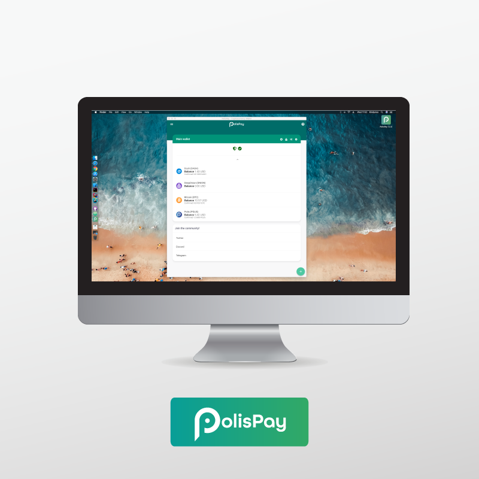

# PolisPay

For further information please make sure you check the official [PolisPay Website](https://polispay.com/home).

## Latest Release
Latest version is [v7.2.3](https://github.com/grupokindynos/polispay-releases/releases/tag/v7.2.3), you can read the changelog there!

## PolisPay Multi Currency Wallet

PolisPay is the best non-custodial multi currency wallet. Keep your crypto safe and take it anywhere by using our mobile and desktop apps. Accepting crypto payments has never been this easy.

PolisPay includes the following features.

* PolisPay Shift: instant conversion between cryptos.  
* ElectrumX compatibility: add your own ElectrumX Server to keep track of your wallet.  
* Full compatibility with **BIP39** (Mnemonic Phrases) and **BIP32** (HD Wallets).  
* On-Device Private Key storage, no data gets into our servers. You are in total control of your assets.  
* Vouchers *[Open Beta]*: Pay for several services using Polis! Gift Cards have never been easier!

## Supported Coins

* Polis (POLIS)
* Bitcoin (BTC)
* Dash (DASH)
* Zcoin (XZC)
* ColossusXT (COLX)
* DigiByte (DGB)
* Groestlcoin (GRS)
* Litecoin (LTC)
* MNPCoin (MNP)
* DeepOnion (ONION)
* Snowgem (XSG) [Coming Soon]

## Repo Information
PolisPay's code is private as it contains important information used to communicate with Card Payment Provider Platforms. This repository contains only the releases for **desktop applications**.

## Mobile Apps
PolisPay is also available in iOS and Android. We hope you'll like them!

  

  

